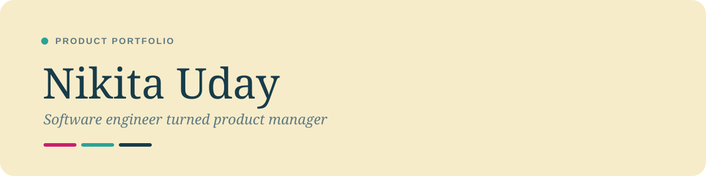

<div align="center">



[](https://react.dev)
[](https://vitejs.dev)
[](https://www.framer.com/motion/)
[](https://nikitauday.github.io)

**Live at [nikitauday.github.io](https://nikitauday.github.io)**

</div>

---

## What's in it

A four-page static site:

- **Home** (`index.html`) — intro, work experience timeline, a filterable
  grid of case studies, credentials (education, resume download), and a
  contact section.
- **Projects** (`projects.html`) — deep-dive case studies (Smart Schedule
  App / Aurora, GUARDIAN, COVID Monitoring System, Shoulder Season), each
  broken into Problem / Approach / Outcome / Methods.
- **Research** (`research.html`) — market and industry research write-ups.
- **About** (`about.html`) — background, photos, and personal notes.

## How it was built

The site is a plain **React + Vite** multi-page app (no router — each
page above is its own HTML entry point that mounts its own React root).
Styling is hand-written CSS using custom properties for a shared design
system (color, spacing, type scale), and **Framer Motion** drives the
scroll fades, staggered reveals, and hover transitions throughout.

Visual design started as mockups in Claude Design (a canvas-based design
tool), then Claude Code implemented and iterated on those designs as the
actual React components you see here — keeping the two in sync as the
copy and layout evolved. GA4 (`gtag.js`) is wired in for basic analytics.

The site deploys automatically: a GitHub Actions workflow
(`.github/workflows/deploy.yml`) builds the app with `npm run build` and
publishes `dist/` to GitHub Pages on every push to `main`.

## Local development

```bash
npm install
npm run dev       # start the Vite dev server
npm run build      # production build to dist/
npm run preview    # serve the production build locally
```

## Project structure

```
src/
  components/   shared UI (Nav, Footer, Reveal, StatSilhouette, ...)
  pages/        AboutPage, ProjectsPage, ResearchPage
  data/         content.js — work cards, experience, education, skills
  hooks/        useHashScroll, useCopyEmail
  assets/       images, logos, resume PDF, diagrams
*.html          per-page entry points (index, about, projects, research)
```

## Brand palette

| | Hex | Used for |
|---|---|---|
|  | `#173c4a` | Ink — body text, headings |
|  | `#5f7a82` | Muted ink — secondary text |
|  | `#c91f6e` | Terracotta — primary accent |
|  | `#2aa298` | Sage — secondary accent |
|  | `#f7ecc9` | Cream — page background |

Heading font: **DM Serif Display**. Body font: **Instrument Sans**.
